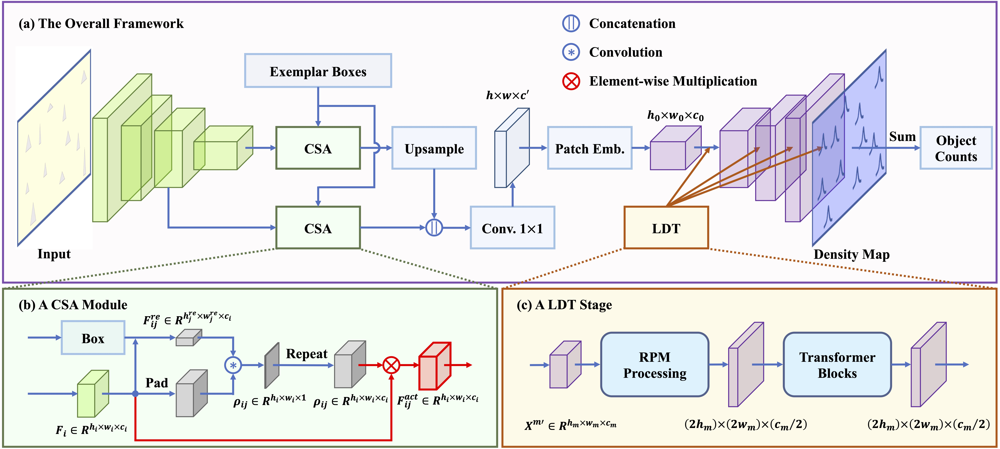

# CSTrans for Counting Everything

This is the official implementation of CSTrans. This repo is created by Zhongyi Huang.


## CSTrans Framework 



## Visualization Results


## Preparatory work

The dataset can be downloaded from here: https://drive.google.com/file/d/1ymDYrGs9DSRicfZbSCDiOu0ikGDh5k6S/view?usp=sharing.

The precomputed density maps can be found here: https://archive.org/details/FSC147-GT.

The whole project directory structure is:

```
PROJECT_DIR
  |--datasets
       |--FSC-147
            |--annotation_FSC-147.json
            |--gt_density_map_adaptive
            |--gt_density_map_adaptive_vis
            |--ImageClasses_FSC-147.txt
            |--img
            |--img_vis
            |--Train_Test_Val_FSC-147.json
  |--cst (the folder name of this source codes)
  |--outputs (auto-created when running this source codes)
  |--torchvision_pretrained_models
```

Before running the codes, please specify the ```PROJECT_DIR``` in ```tools/constants.py```.

## Training
The training commands are summarized in the ```run_train.sh```.

## Testing
For testing, please set the ```dir_list_list``` of ```run_test.py```, and run:

```
python3 run_test.py
```


## Additional Information
If you find CSTrans helpful, please cite it as
```
@article{gao2024cstrans,
  title={CSTrans: Correlation-guided Self-Activation transformer for counting everything},
  author={Gao, Bin-Bin and Huang, Zhongyi},
  journal={Pattern Recognition},
  pages={110556},
  year={2024},
  publisher={Elsevier}
}
```


## Acknowledgement

This repo is developed based on [FamNet](https://github.com/cvlab-stonybrook/LearningToCountEverything).


